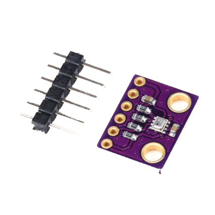

# Universidade de São Paulo
## Escola de Engenharia de São Carlos

# Aerial-Vehicles-Embedded-Systems
SAA0356 - Sistemas Embarcados para Veículos Aéreos (2020/2)

## Alunos:
| Nome | Nº USP |
| ----------- | ----------- |
|Bruno Henrique Gati | 11222482|
|Luiz Mauricio Dias Rodrigues | 9805932|

## Docente:
Profº Dr. Glauco Augusto de Paula Caurin

## Escopo do Projeto

Neste projeto, pretende-se implementar um controle autônomo para as aletas de um foguete para a modalidade de foguetemodelismo.

Os requisitos propostos são os seguintes:

- **Controle autônomo de posição**: O computador de bordo deve autoregular a aleta do foguete visando a manutenção da rota esperada utilizando posicionamentos intermerdiários para aumentar a estabilidade do foguete.

- **Sensores**: O sistema deve possuir altímetro e acelerômetro.

- **Linguagem**: A linguagem definida foi a linguagem C visando utilizar a placa fornecida pela Toradex.

- **Servomotor**: O servomotor deve ter capacidade de defletir as aletas, possuindo torque suficiente para isso.

Os demais detalhes e especificações dos Requisitos Funcionais estão dispostos abaixo:

## Arquitetura do projeto

## Visualização do foguete
A seta vermelha representa as aletas móveis e a seta azul representa as aletas fixas:

## Subsistemas
O projeto foi dividido em dois subsistemas: dados e controle, que serão destrinchados a seguir

### Subsistema de dados
O objetivo desse subsistema é adquirir dados para que o servomotor possa agir.

Ele é composto por dois sensores e um cartão SD.

Os dois sensores são os seguintes: BMP280 e MPU6050.

O BMP280 é o altímetro, esse consegue a altitude atual a partir da obtenção da pressão que será convertida por meio do código.

Já o MPU6050 é um acelerômetro e giroscópio, que fornecerá ao microcontrolador geral a inclinação atual do foguete em relação ao lançamento para que o servomotor possa corrigir a tragetória.

### Subsistema de controle

O objetivo desse subsistema é mover e controlar o servomotor e garantir a estabilidade do foguete

Os componentes desse subsistema são o servomotor, o módulo da Toradex VF50 e a Viola V1.2

O servomotor irá movimentar as aletas

O módulo VF50 e a Viola V1.2 irão receber os dados do subsistema de sensores e coordenar os movimentos com base no software instalado

## Trechos do código

Declaração de variáveis e funções

